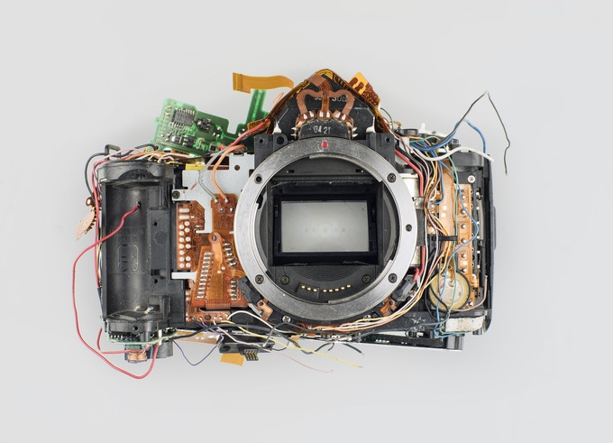

<div id="top"></div>

<br />
<div align="center">
    
<h2 align="center">A Broken Camera</h2>

  <p align="center">
    The solution to unsollicited pictures
    <br />
    <a href="https://github.com/Michiel-Vanzeir/broken-camera/issues">Report Bug</a>
    ·
    <a href="https://github.com/Michiel-Vanzeir/broken-camera/issues">Request Feature</a>
  </p>
</div>

<!-- ABOUT THE PROJECT -->
## About The Project

Do you often get attacked by relatives with cameras on family gatherings? Broken Camera is the solution to all of your misery. Using Google's Mediapipe face detection and a custom trained CNN, this script is able to detect when someone has their eyes closed in an image. Integrate this with a Raspberry Pi and a camera, and no longer will any usable pictures be taken of you!

<br />

<!-- GETTING STARTED -->
## Getting Started


### Prerequisites

* Python 3
* Pip

### Installation


1. Clone the repo
   ```sh
   git clone https://github.com/Michiel-Vanzeir/broken_camera.git
   ```
2. Install the required libraries
   ```sh
   pip3 install -r requirements.txt
   ```
3. Enjoy the repo!
<br />
<br />


<!-- LICENSE -->
## License

Distributed under the MIT License. See `license` for more information.


<!-- CONTACT -->
## Contact

Michiel Vanzeir - michiel.vanzeir@gmail.com

Project Link: [https://github.com/Michiel-Vanzeir/broken-camera](https://github.com/Michiel-Vanzeir/broken-camera)
